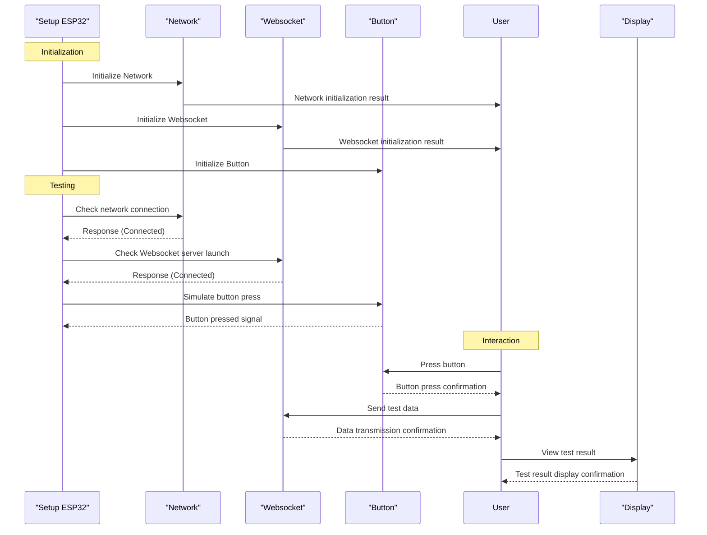
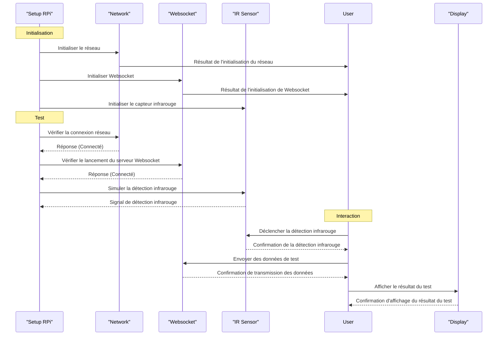

## Diagrame séquence ESP32

```mermaid
sequenceDiagram
    participant Setup as "Setup ESP32"
    participant Network as "Network"
    participant Websocket as "Websocket"
    participant Button as "Button"
    Participant User as User
    participant Display as "Display"

    Note over Setup: Initialization
    Setup ->> Network: Initialize Network
    Network ->> User: Network initialization result
    Setup ->> Websocket: Initialize Websocket
    Websocket ->> User: Websocket initialization result
    Setup ->> Button: Initialize Button

    Note over Setup: Testing
    Setup ->> Network: Check network connection
    Network -->> Setup: Response (Connected)
    Setup ->> Websocket: Check Websocket server launch
    Websocket -->> Setup: Response (Connected)
    Setup ->> Button: Simulate button press
    Button -->> Setup: Button pressed signal

    Note over User: Interaction
    User ->> Button: Press button
    Button -->> User: Button press confirmation
    User ->> Websocket: Send test data
    Websocket -->> User: Data transmission confirmation
    User ->> Display: View test result
    Display -->> User: Test result display confirmation
```

## Diagrame séquence Raspberry Pi 4

```mermaid
sequenceDiagram
    participant Setup as "Setup RPi"
    participant Network as "Network"
    participant Websocket as "Websocket"
    participant IR_Sensor as "IR Sensor"
    Participant User as User
    participant Display as "Display"

    Note over Setup: Initialisation
    Setup ->> Network: Initialiser le réseau
    Network ->> User: Résultat de l'initialisation du réseau
    Setup ->> Websocket: Initialiser Websocket
    Websocket ->> User: Résultat de l'initialisation de Websocket
    Setup ->> IR_Sensor: Initialiser le capteur infrarouge

    Note over Setup: Test
    Setup ->> Network: Vérifier la connexion réseau
    Network -->> Setup: Réponse (Connecté)
    Setup ->> Websocket: Vérifier le lancement du serveur Websocket
    Websocket -->> Setup: Réponse (Connecté)
    Setup ->> IR_Sensor: Simuler la détection infrarouge
    IR_Sensor -->> Setup: Signal de détection infrarouge

    Note over User: Interaction
    User ->> IR_Sensor: Déclencher la détection infrarouge
    IR_Sensor -->> User: Confirmation de la détection infrarouge
    User ->> Websocket: Envoyer des données de test
    Websocket -->> User: Confirmation de transmission des données
    User ->> Display: Afficher le résultat du test
    Display -->> User: Confirmation d'affichage du résultat du test

```